# gh-projects-boards 操作マニュアル

GitHub Projectsのタスクを使い、実績・残工数の更新、日程調整、担当者ごとの工数確認を行うWindowsアプリです。日々の編集はローカルに保存し、確認した変更だけをGitHubへ反映します。

画面上の列名は、接続先のGitHub Projectで付けられた名前です。このマニュアルの「見積」「実績」「残時間」「開始日」「終了日」は、**計画の前提**で対応付ける役割を指します。スクリーンショットのProject名・タスク名・値は操作例です。

## 目的から探す

| やりたいこと | 読むところ |
| --- | --- |
| 初めて使う・Projectを開く | [接続とProject登録](#接続とproject登録) |
| 工数の列・担当者・稼働日を設定する | [計画の前提を設定する](#計画の前提を設定する) |
| 来年の祝日を取り込む | [祝日CSVを取り込む](#祝日csvを取り込む) |
| 毎週の実績・残工数を更新する | [Boardsで実績と残工数を更新する](#boardsで実績と残工数を更新する) |
| 複数人の実績・残工数を配分する | [担当者別の工数をまとめて入力する](#担当者別の工数をまとめて入力する) |
| 複数行へ同じ値を入れる・Excelから貼る | [範囲選択と一括更新](#範囲選択と一括更新) |
| バーを動かして日程を変更する | [Ganttで日程を調整する](#ganttで日程を調整する) |
| 工数超過を見つける・週次報告を作る | [Summaryで工数を確認する](#summaryで工数を確認する) |
| 実績・残工数だけGitHubに反映する | [週次更新をGitHubに反映する](#週次更新をgithubに反映する) |
| 保存・反映に失敗した | [問題が起きたとき](#問題が起きたとき) |

## 画面と作業の流れ

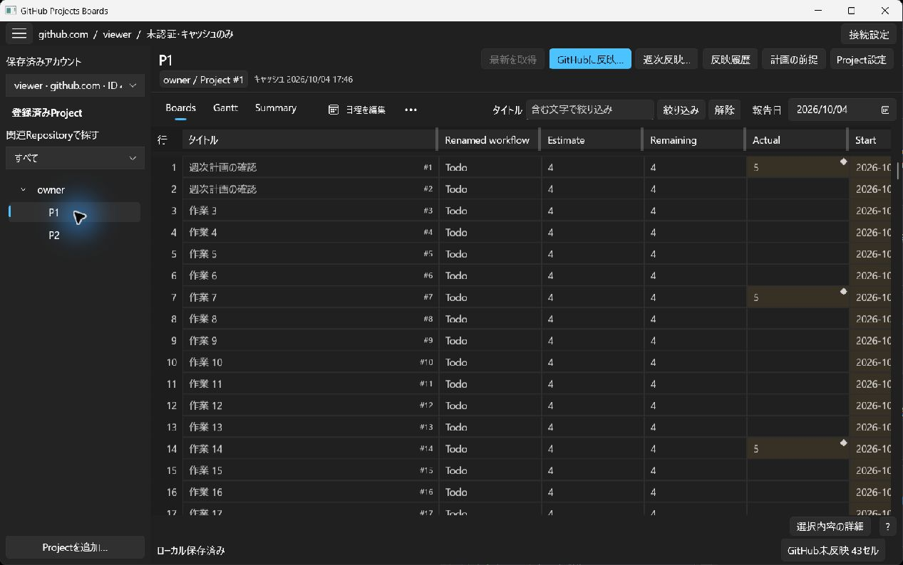

左側でアカウントとProjectを選び、中央の **Boards / Gantt / Summary** を切り替えます。Project一覧が閉じている場合は左上の一覧ボタンで開きます。

Project上部の操作は1本のツールバーにまとまっています。幅が狭いときは **…** を開くと、**週次反映…・反映履歴・計画の前提・Project設定** などの操作を選べます。Boards・Gantt・Summary内の編集ツールバーも同じ操作です。画面上部の **マニュアル** から、この手順を開けます。

| 画面・コマンド | 主な用途 |
| --- | --- |
| Boards | セルの編集、複数行の工数更新、並べ替え・絞り込み |
| Gantt | 日程の比較、Manualタスクの移動・伸縮、先行・後続関係の作成と確認 |
| Summary | 担当者別の投入可能工数・完了見込み・超過の比較、報告のコピー |
| 計画の前提 | 開始日時、再計画の基準、列の対応、担当者配賦、カレンダー |
| Project設定 | Project情報、権限診断、既定Repository、ローカル登録の解除 |
| 接続設定 | GitHubのホスト・アカウントとCLIの接続確認 |

週次更新は、次の順番で進められます。

1. Projectを開き、必要に応じて **最新を取得** します。
2. **報告日**を選び、Boardsで累計実績と残時間を更新します。
3. Summaryで超過担当者を選び、そのタスクの残時間や計画を見直します。
4. 必要に応じてGanttで日程を調整します。
5. **週次反映…** で実績・残工数を確認し、最後の反映ボタンでGitHubへ送ります。
6. Summaryの **週次報告をコピー** でMarkdownを作り、対策を記入して共有します。

### ローカル保存・確定・GitHub反映の違い

| 状態・操作 | 意味 |
| --- | --- |
| 入力途中 | セル内の文字は残っていますが、まだ計算や反映の対象にはなっていません。 |
| セルを確定・ダイアログで確定 | ローカルの値として採用し、必要な計算を更新します。 |
| ローカル保存 | 次回起動時に作業を復元するための保存です。入力途中の文字も保持されます。 |
| 未反映 | 確定したローカル変更がGitHubへの反映対象として残っています。 |
| GitHubに反映 | 対象と差分を確認したうえで、選択した変更を送ります。 |

表の編集、範囲操作、日程計算、表示切り替え、MarkdownコピーだけではGitHubは更新されません。画面の **?** や詳細コマンドでは、その場の操作や値の意味を確認できます。

## 接続とProject登録

### 初回の接続

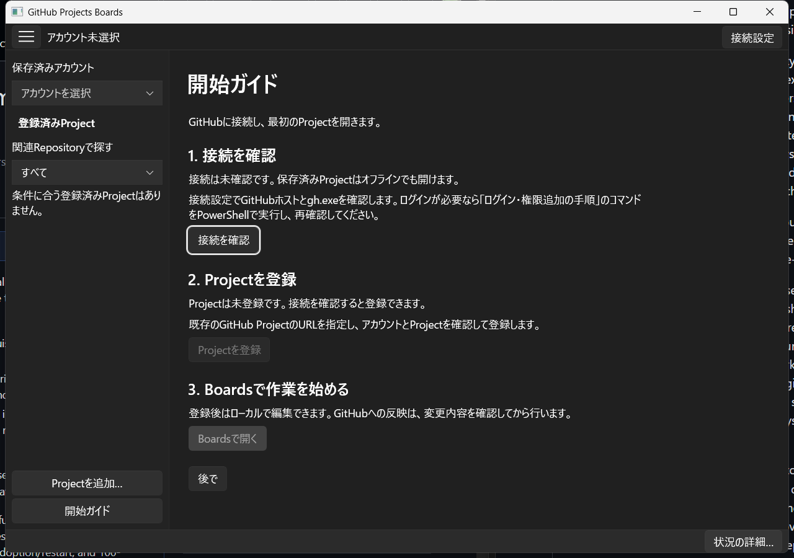

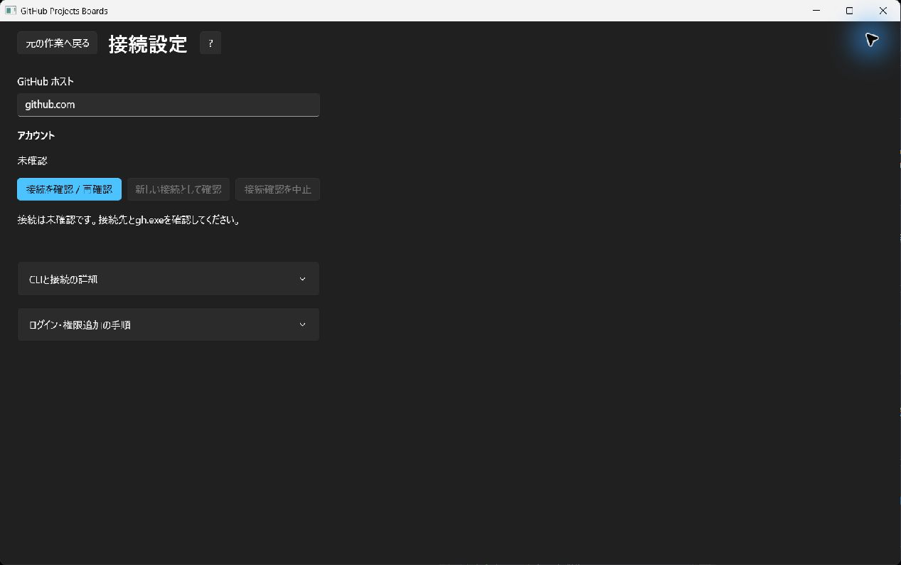

初回起動では **GitHubに接続** を押します。接続が確認できると **Projectを追加**、登録後は **Boardsで開く** が次の操作になります。画面には現在必要な操作だけが表示されます。途中で **後で** を選んでも、空のワークスペースや **接続設定** から続けられます。

1. **GitHubに接続**、またはワークスペースの **接続設定** を開きます。
2. **GitHub ホスト**を確認します。通常のGitHub.comは `github.com` です。
3. 必要なら **CLIと接続の詳細** を開き、使用する `gh.exe` を指定します。
4. **接続を確認 / 再確認** を押し、アカウントと接続状態を確認します。
5. **元の作業へ戻る** でワークスペースへ戻ります。

ログインや権限追加が必要な場合は **ログイン・権限追加の手順** を開き、表示されたコマンドを自分のPowerShellで実行してください。ブラウザーでの認証が終わったら、この画面で再確認します。

`gh.exe` が見つからない場合は、**CLIと接続の詳細** で使用する実行ファイルを指定して再確認します。認証コマンドは自動実行されません。新しいProjectを登録するには、先に接続を確認します。

意図して別のアカウント・ホスト・CLIへ変更した場合は、接続先を確認して **新しい接続として確認** を使います。別アカウントの作業は、現在の作業とは分けて保存されます。

### Projectを登録する

1. 接続確認後の **Projectを追加**、または左側の **Projectを追加…** を開きます。
2. **Project URL** に対象ProjectのURLを入力し、**URLを確認** を押します。
3. Project名、所有者、接続先アカウントを確認します。
4. 必要に応じて、新規行の既定Repositoryを `owner/repository` 形式で指定します。
5. **登録** を押します。

URLが分からない場合は **所有者・Repositoryから探す** を開きます。所有者を指定し、必要ならRepositoryで絞ってProjectを検索します。Repositoryに関連付いていないProjectは、URL指定または所有者の全Project検索を使ってください。

登録は、既存のGitHub Projectをこのアプリで使えるようにする操作です。新しいGitHub Projectを作成する操作ではありません。

初回登録後は、登録済みProjectを確認して **Boardsで開く** を押します。URLの確認や取得に失敗した場合は、表示された理由を確認して修正します。前の画面へ戻っても、入力した登録候補は保持されます。

### 保存済みProjectを再び開く

アプリを起動し、**保存済みProjectを開く** で表示されるアカウント候補から選び、左側でProjectを開きます。左側の **保存済みアカウント** からも選べます。保存済みの内容はオフラインでも確認でき、編集可能な行ではローカル編集もできます。更新権限や取得内容が未確認で参照専用になっている行は、接続を確認して **最新を取得** してください。

登録済みProjectがある場合、再起動後は保存済みアカウントとProjectを選んで続けます。オフラインのままでもローカルの作業を開けます。

初めて起動するためのビルド手順は [READMEのBuild and run](../README.md#build-and-run) を参照してください。

## 計画の前提を設定する

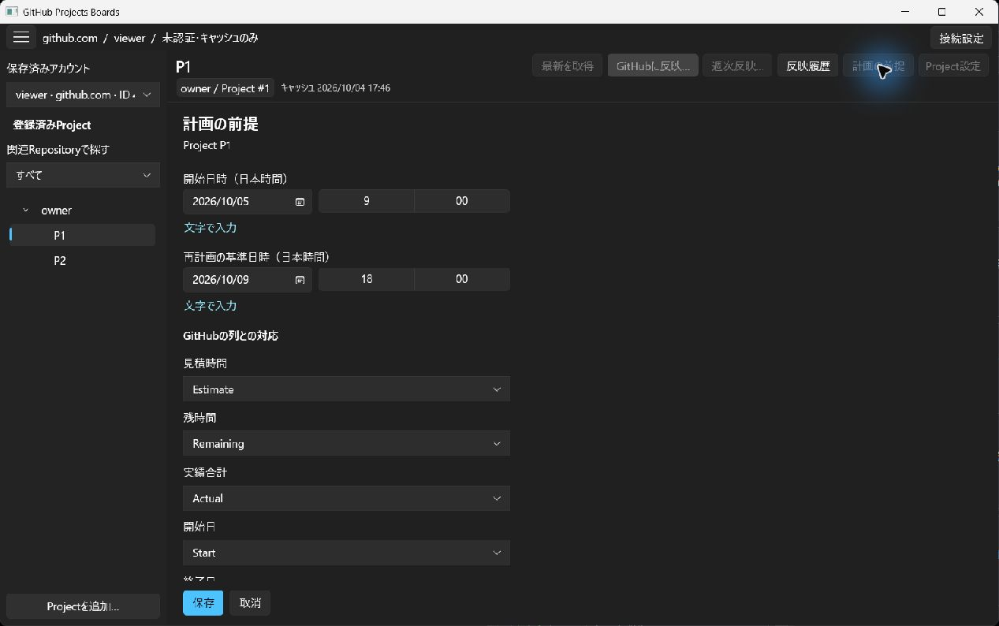

Project上部の **計画の前提** を開きます。Boards・Gantt・Summaryのどの画面からも開けます。初めて計画を作る場合は **計画を始める** からも進められます。

1. **開始日時（日本時間）** に、計画を始める日時を指定します。
2. **再計画の基準日時（日本時間）** に、残作業をいつから計画するかを指定します。
3. **GitHubの列との対応** で、各役割に使用するProjectの列を選びます。
4. **担当者・配賦** を開き、対象者とこのProjectへ配賦する割合を設定します。
5. 必要に応じてカレンダーと祝日を設定し、**保存** を押します。

担当者やカレンダーの設定が見えない場合は、ページの内容を下へスクロールしてください。

| 役割 | GitHub側の列の型 | 入力・表示する値 |
| --- | --- | --- |
| 見積時間 | NUMBER | タスク全体の見積人時 |
| 残時間 | NUMBER | これから必要な人時 |
| 実績合計 | NUMBER | 担当者別の報告から合計した累計人時 |
| 開始日 | DATE | 採用した開始日時の日付部分 |
| 終了日 | DATE | 採用した終了日時の日付部分 |

同名の列が複数ある場合は、名前だけで判断せず、表示される識別情報を確認してください。候補にない列はGitHub側で型や取得状況を確認し、必要なら最新情報を取得します。

前提の保存だけでは、すべてのタスクに日程が設定されるわけではありません。日程未設定の行で見積を入力・確定すると自動計算を始めます。既存の値を使う場合は、対象行を選び **… → 自動計算を設定**、または **日程を編集** で計画方法を選びます。

**報告日**と**再計画の基準日時**は別です。報告日は「実績がいつまでの値か」、再計画の基準日時は「残作業をいつから配置するか」を表します。実績入力のためだけに再計画の基準を動かす必要はありません。

### 配賦と稼働日

工数は人時のまま入力します。たとえば配賦を50%にしても、見積8人時を4人時へ書き換える必要はありません。配賦は、日程計算に使う稼働可能量へ反映されます。

通常の稼働時間は平日 `09:00–13:00,14:00–18:00` です。会社休日や担当者の休暇は **カレンダー・祝日 → 日付例外を追加** で設定できます。

1. 例外の日付を `yyyy-MM-dd` で入力します。
2. **対象**をProject共通、または担当者から選びます。
3. 稼働する時間帯を入力します。休日にする場合は時間帯を空にします。
4. **保存** します。

同じ日の条件は、担当者別例外、Project共通例外、通常週と祝日の順に採用されます。誤った例外は **例外を削除** してから保存します。

## 祝日CSVを取り込む

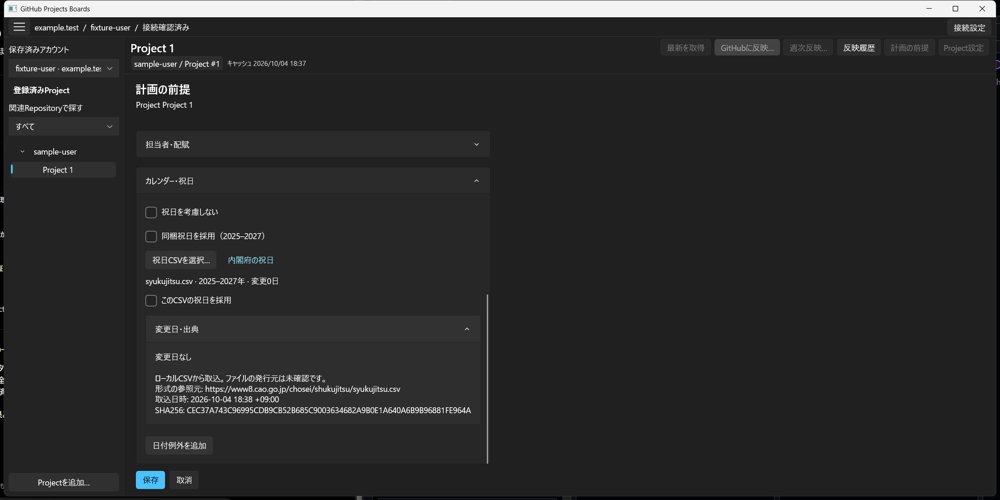

祝日はProjectごとに採用します。新しい年の定義を使う場合も、自動で置き換わることはありません。

1. **計画の前提 → カレンダー・祝日** を開きます。
2. **内閣府の祝日** から公式サイトを開き、祝日CSVを保存します。
3. **祝日CSVを選択…** を押して、保存したファイルを選びます。
4. 表示された対象年と変更日数を確認します。**変更日・出典** を開くと、追加・削除・名称変更の各日付を確認できます。
5. **このCSVの祝日を採用** にチェックし、ページ下部の **保存** を押します。

ファイル選択だけでは採用されません。取りやめる場合はチェックを外すか、ページの **取消** を使います。同梱データへ切り替える場合は **同梱祝日を採用** を選んで保存します。

対応形式は1MiB以下のUTF-8またはShift-JISのCSVで、見出しは次の2列です。

```csv
国民の祝日・休日月日,国民の祝日・休日名称
```

公式CSVは必要な年を含む全体を保存してください。日付の重複、年の欠落、採用済み期間を短くするファイルなどは受け付けません。形式チェックはファイルの発行元や祝日の完全性を保証するものではないため、取込元は確認してください。

採用するとAutoタスクの日程を再計算します。Manualの日時、実績、既存の日付例外、保護した基準計画は保持されます。**祝日を考慮しない** は祝日計算を意図して外す設定です。未取得の年を「祝日なし」と判断するための設定ではありません。

## Boardsで実績と残工数を更新する

### セルを編集する

セルを選んで入力するか、**F2** で編集を始めます。**Enter** で値を確定して下へ、**Tab** で確定して右へ進みます。日本語変換中のEnterは変換の確定に使われ、次のEnterでセルを確定します。

数字や文字が不正な場合は、その入力を残してエラーを示します。**選択内容の詳細** で入力途中と確定済みの値を確認し、修正してください。

### 実績と残時間を更新する

1. Project上部の **報告日** を、今回の実績が対象とする最終日に合わせます。
2. 実績の列に、その日までの**累計人時**を入力します。
3. 残時間の列に、完了までに今後必要な人時を入力します。
4. Enterで確定し、次の行へ進みます。

たとえば、前回の累計実績が5人時で、今回2人時を追加した場合は、実績を **7** と入力します。今後3人時かかる見込みなら、残時間は **3** です。残時間は「見積－実績」ではなく、独立した見積です。

既に報告がある行では、その報告担当者を保持します。新しい報告では、確認済みの担当者が1人ならその人を使用します。担当者を決められない場合や複数人の実績がある場合は **実績の詳細 → 内訳**、または **タスクの詳細** で担当者・人時・報告対象日を入力します。合計が人数で自動分割されることはありません。

`0` は「実績ゼロとして報告した」値です。未入力や実績記録の削除とは異なります。実績記録を消す場合は **実績を削除** を使います。

### 担当者別の工数をまとめて入力する

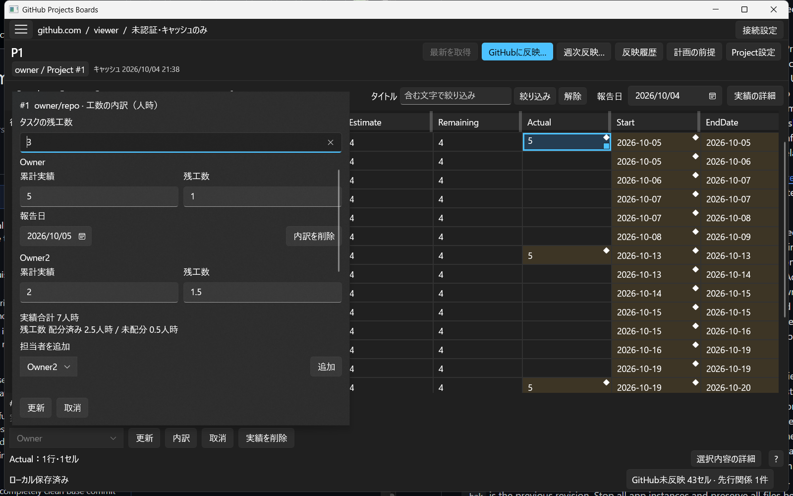

1. 対象行の実績セルを選び、**実績の詳細 → 内訳** を開きます。複数人の実績がある行では **内訳** が直接表示されます。
2. **タスクの残工数** に、タスク全体で今後必要な人時を入力します。
3. 担当者ごとに **累計実績** と **残工数** を入力し、実績の **報告日** を確認します。足りない担当者は **担当者を追加 → 追加** で増やします。
4. 実績合計、残工数の配分済み合計と **未配分** を確認し、**更新** を押します。

たとえば残工数合計が3人時で、Aへ1人時、Bへ1.5人時を割り振った場合、差額の0.5人時は **未配分** として保持します。合計を人数で均等割りしたり、実績から残工数を自動計算したりしません。担当者別の残工数合計は、タスク全体の残工数以下にしてください。

既存の実績は担当者と報告日を保持し、新しく追加した担当者の報告日はProject上部の報告日を初期値にします。空欄は未入力であり、`0` とは異なります。過去の担当者の実績を外す場合は、その人の **内訳を削除** を使います。全実績を消す操作は既存の **実績を削除** です。見積の担当者別内訳や計画上の進捗は、この画面では変更しません。

担当者が多い場合は内訳の一覧をスクロールします。**取消** はこの画面の変更を破棄し、**更新** は入力全体をまとめて確定します。確定後はツールバーの **元に戻す** 一回で、実績・残工数・内訳・再計算を一緒に戻せます。入力中の表の合計と内訳が一致しない場合や、入力先の取得状態に問題がある場合は、一部だけを更新せずエラーを示します。残工数の列が設定されていない場合は、実績の内訳だけを編集できます。

### 進捗も一緒に変える

対象行を選び、**実績・進捗** を開きます。ここでは累計実績、残時間、報告担当者・日付、計画上の進捗をまとめて確定できます。

| 計画上の進捗 | 日程計算と入力 |
| --- | --- |
| 未着手 | 見積を使って計算します。 |
| 進行中 | 残時間を使って再計画します。 |
| 完了 | 残時間0と実績開始・終了を入力します。 |
| 再開 | 完了したタスクを再開し、残時間を明示して確認します。 |

実績を増やすだけでは計画上の進捗は変わりません。Manualタスクは進捗を変えても、指定した日時を保持します。

GitHub ProjectのStatusなども変更する場合は、**一緒に変更するProject項目（任意）** で項目と値を選びます。「計画上の進捗」とProjectの選択項目は別です。選択した変更候補と確定済みの値を確認して **確定** してください。

**取消** はこの画面で行った変更を取り消します。開く前から残っていた入力途中の文字は保持します。変更途中で **タスクの詳細** へ移動する場合は、破棄するか編集を続けるかを選べます。

## 範囲選択と一括更新

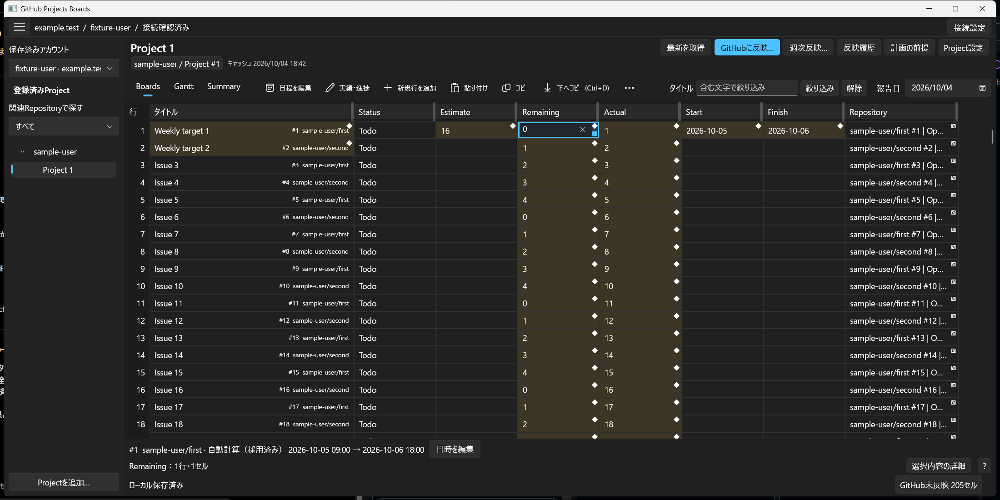

### 範囲を選ぶ

先頭セルを選び、**Shift＋矢印** または **Shift＋クリック** で範囲を広げます。文字を編集している最中は、先に確定または取消してセルの選択へ戻ります。範囲選択中は **範囲操作** から貼り付けや下方向コピーを選べます。

### Ctrl+Dで同じ値を下へコピーする

1. コピー元となる先頭セルの値を入力し、確定します。
2. そのセルからコピー先の最終行まで、**1列の縦範囲**を選びます。
3. **Ctrl+D** または **下へコピー (Ctrl+D)** を実行します。

選んだ範囲の一番上の値を、その下のセルへコピーします。空の値はコピーできません。選択項目・見積・残時間を空にする場合は **値をクリア**、実績記録を消す場合は **実績を削除** を使います。

### フィルハンドルでコピーする

値のあるセルを選び、右下の小さなハンドルを上下へドラッグします。ドラッグ中は対象範囲のプレビューが表示され、マウスを離した時点で反映されます。画面の端ではスクロールしながら範囲を広げられます。取りやめる場合は離す前に **Esc** を押します。

数値の連番や日付の系列を生成する操作ではなく、元の値をコピーする操作です。

### Excelなどから複数行を貼り付ける

Excel上で必要な行・列をコピーし、Boardsで貼り付け先の左上セルを選んで **Ctrl+V** または **貼り付け** を実行します。タブ区切り、行ごとに改行されたTSVとして扱います。

列を左から**実績・残時間の順**に並べた場合、次の2列3行を貼り付けると、3タスクの累計実績と残時間を更新できます。画面上の列順が逆の場合は、貼り付けデータも合わせてください。見出し行は含めません。

```text
7	3
12	8
0	16
```

複数セルを先に選ぶ場合は、貼り付けデータと同じ行数・列数の範囲を選びます。1つの値を1列の縦範囲へ貼り付けることもできます。

| 条件 | 扱い |
| --- | --- |
| 貼り付けた空欄 | そのセルは変更しません。選択項目・見積・残時間を空にするには **値をクリア** を使います。タイトルは空にできません。実績の削除は専用の **実績を削除** を使います。 |
| 表示順を変更した列 | 現在表示されている列の順に貼り付けます。非表示列には飛びません。 |
| 既存行を超えるデータ | 新しい行は自動追加しません。範囲外として取り消します。 |
| 行ごとの列数が不一致、無効な値、編集できないセル | 一部だけを更新せず、操作全体を取り消します。 |
| 単一選択の値 | GitHub上の選択肢名と一致させます。同名候補が複数ある場合は個別の選択UIで指定します。 |

### 実績を含む一括更新

実績を含む場合は、先に共通の **報告日** を選んでください。実績単独のCtrl+D・フィル、または見積・実績・残時間を組み合わせた矩形貼り付けができます。実績と無関係な列や日付を同じ矩形で更新することはできません。

コピーするのは人時です。各行の報告担当者は保持され、コピー元の担当者へ置き換わりません。担当者や実績内訳が曖昧な行、未確定入力、競合が含まれる場合は、対象行を確認してからやり直します。

### 一括操作を取り消す

貼り付け・フィル・Ctrl+Dは、1回の操作をまとめて **元に戻す** で取り消せます。先頭セルを編集してから下へコピーした場合、1回目のUndoはコピー先、2回目は先頭セルの編集を戻します。

文字編集中のCtrl+Zは、その入力欄の文字編集を取り消します。表全体の操作を取り消す場合は、ツールバーの **元に戻す** を使ってください。

Undoはローカル操作の取消です。既にGitHubへ反映した変更を取り消す操作ではありません。反映や競合によって安全に戻せなくなった操作は、理由を表示して保持します。

### 列・並べ替え・フィルターを整える

**列** で表示する列、順番、幅を設定し、**ローカル保存** します。週次更新では実績と残時間を並べると、矩形貼り付けがしやすくなります。

**並べ替え・フィルター** でタイトルや選択項目の条件を指定し、**ローカル保存・適用** します。編集中に行が勝手に移動することはありません。値の変更を表示順・絞り込みへ反映したいときに **再適用** を押します。

非表示の行や列にも変更は残っています。フィルターを外したり列を表示したりすると、引き続き編集できます。GitHub反映時の対象範囲も確認してください。

### 行数の多いProjectで作業する

Boardsでは列見出しを確認しながら、縦横にスクロールして対象セルを選びます。遠くの行を探す場合はタイトルや選択項目で絞り込み、Ganttでは検索と **選択へ移動** を使います。表示を移動しても、画面外の確定済み変更や入力途中の値は保持されます。行数にかかわらず、入力途中の文字と確定済みの変更、GitHubへの反映は別の状態です。

### 新規行を準備する

**新規行を追加** でローカル行を作り、タイトル、必要な値、最後の列の宛先Repositoryを入力します。既存行を元にする場合は **選択行を複製** が使えます。

複数の新規行は **新規行として貼り付け** を使います。確認画面に示されるTSV列順と宛先に合わせてください。通常の貼り付けとは異なり、こちらは行を追加する操作です。

不要なローカル行は **新規行を削除** で消せます。既存のGitHub Issueを含む選択では実行できません。準備した行からIssueを作成する場合は、通常の **GitHubに反映…** で新規作成対象を確認します。

## Ganttで日程を調整する

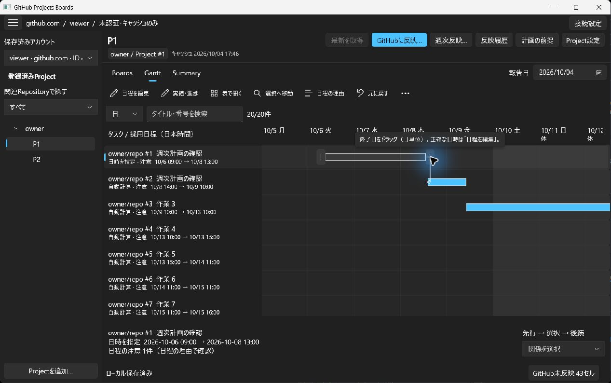

**Gantt** を開き、対象タスクを選びます。日／週の表示を切り替えて期間を比較できます。タスク名だけで判別しにくい場合は、RepositoryとIssue番号も確認してください。

### 自動計算と日時指定

**日程を編集** で日程の決め方を選びます。

| 方法 | 用途 |
| --- | --- |
| 自動計算（Auto） | 工数、担当者配賦、カレンダー、前後関係を使って日程を求めます。 |
| 日時を指定（Manual） | 開始・終了日時を自分で決め、保持します。 |

日時は日本時間の分単位です。日付・時刻のコントロールで選ぶか、**文字で入力** を押して `2026-10-05 09:30` のように入力します。変更前後の日程を確認して **適用** を押します。

開始か終了の片方だけを保持することもできます。その場合は完全な期間のバーにはならず、不足している日時を示します。日付だけ取得した値を、勝手に特定の時刻として扱うことはありません。

### バーを移動・伸縮する

開始・終了が確定している、未完了のManualタスクが対象です。

1. タスクを選択します。
2. バーの中央部分を左右にドラッグすると、期間全体を移動できます。
3. 選択したバーの左右端のハンドルをドラッグすると、開始または終了だけを変更できます。
4. プレビューを確認し、マウスを離すとローカル変更を確定します。

ドラッグは**暦日単位**で移動し、時刻は保持します。たとえば09:30開始のバーを右へ1日動かすと、翌日の09:30開始になります。分単位の変更には **日程を編集** を使います。

ドラッグ中の **Esc** で取消、確定後の **元に戻す** で復元できます。終了が開始より前になる変更は受け付けません。Auto・完了済み・日時が不完全なタスクや、競合・入力途中の値があるタスクでは、先に状態を確認してください。

### 先行・後続関係をドラッグで作る

1. 先行タスクを選びます。開始・終了が確認できるバーの終了側に、依存関係用の **↗** ハンドルが表示されます。
2. **↗** から後続タスクのバーへドラッグします。
3. プレビューの先行・後続を確認し、マウスを離すと **終了→開始（FS）** の関係をローカルに追加します。

**↗** は依存関係用です。バー本体の移動や左右端の伸縮ハンドルとは別の操作で、先行タスクの日程自体は動かしません。追加した関係に応じて後続のAuto日程を再計算します。同じタスクへの結線、既にある関係、循環する関係は追加できません。ドラッグ中は **Esc** で取り消せます。

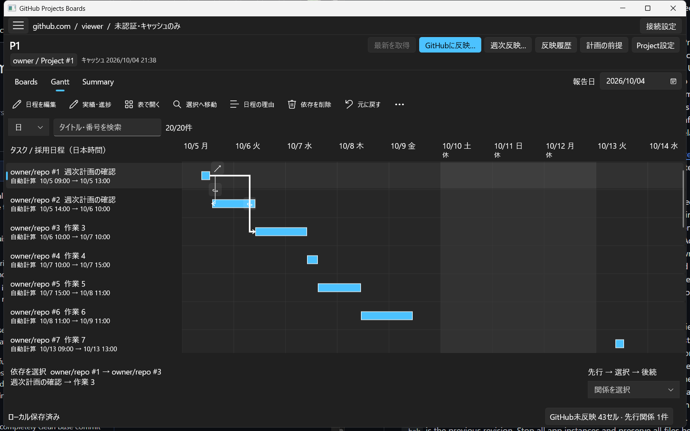

関係を削除する場合は、表示された線の選択ボタン **↪** を押し、対象を確認して **依存を削除** を使います。追加・削除はそれぞれ **元に戻す** 一回で取り消せます。キーボードで関係を追加する場合や、バーのないタスクを扱う場合は **タスクの詳細 → 先行Issue（終了→開始）** を使います。

結線や削除だけではGitHubへ送信しません。依存関係も反映する場合は、通常の **GitHubに反映…** で変更を確認します。

### 前後関係と計算理由を確認する

選択したタスクの先行・後続を関係選択欄から確認できます。日程の理由や警告には、該当する担当者・工数・カレンダー・先行タスクなどが表示されます。

先行関係はチャート上の操作に加え、**タスクの詳細 → 先行Issue（終了→開始）** からも変更できます。

**表で開く** は同じタスクをBoardsで開きます。対象がBoardsのフィルター外なら一時的に表示します。変更した日程が画面外にある場合は **変更後の日程を見る** または **選択したタスクの日程を見る** で移動できます。

## Summaryで工数を確認する

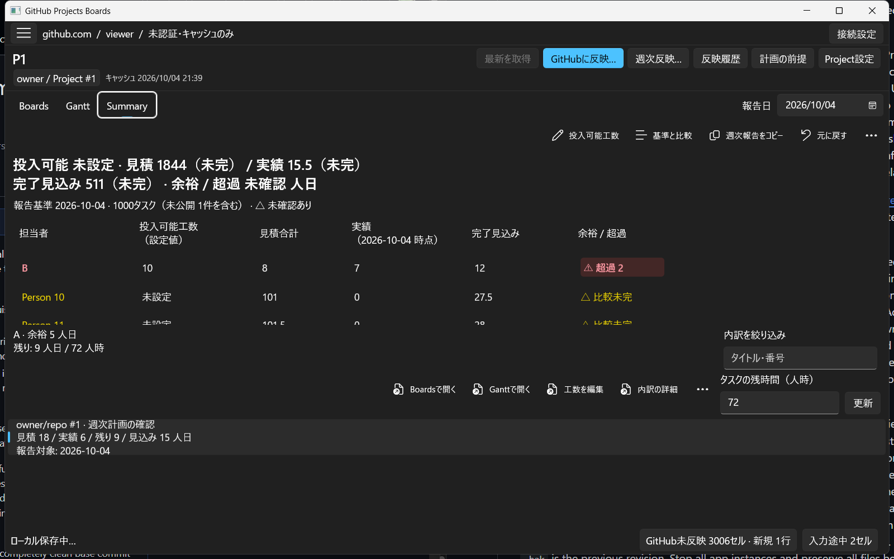

SummaryはProject全体の工数を人日で表示します。**1人日＝8人時**です。

| 項目 | 意味 |
| --- | --- |
| 投入可能工数 | その担当者がこのProjectに投入できる総工数の設定値 |
| 見積合計 | 担当する作業の見積 |
| 実績 | 報告基準日までの累計実績 |
| 完了見込み | 累計実績＋独立して入力した残時間 |
| 余裕／超過 | 投入可能工数と完了見込みの差 |

### 超過している担当者から見直す

1. 必要なら担当者を選び、**投入可能工数** で、その人がこのProjectに投入できる総人時を設定します。
2. 上位に表示される **⚠ 超過** の担当者を確認します。超過欄は警告の背景色で強調され、担当者名と超過値は警告色・太字になります。比較未完は注意色と **△ 比較未完** で区別されます。記号と文言でも状態を確認できます。
3. 担当者を選ぶと、下部に寄与しているタスクが表示されます。
4. タスクを選んで **タスクの残時間（人時）** を修正し、**Enter** または **確定** で確定します。**Esc** はその入力途中だけを取り消します。
5. 実績や進捗も見直す場合は **実績・進捗** を開きます。確定・取消後は同じ担当者とタスクへ戻ります。日程や依存関係の詳細は **… → タスクの詳細**、表や日程で比較する場合は **Boardsで開く**、**Ganttで開く** を使います。

残時間の入力途中は、担当者・タスクの選択やビューの往復、報告日の変更では消えません。保存して再起動した後も同じタスクから続きを入力できます。不正な値は確定せず、入力欄の近くに訂正理由を表示します。確定した修正は **元に戻す** で1操作ずつ取り消せます。Summaryからの編集も、GitHubへ自動反映されることはありません。

**比較未完**、**不明**、**未完**はゼロを意味しません。投入可能工数が未設定、必要な実績や残時間が未入力、報告が古いなどの理由を、タスクを選んで **内訳の詳細** から確認してください。

**内訳を絞り込み** は選択した担当者のタスク探しに使います。高さが低い場合は、タスク操作の **…** から開きます。Project全体の集計値や報告範囲を変更するものではありません。

### 基準計画と比較する

**… → 基準を確立…** で、その時点の見積・採用日程・計画条件を記録できます。以後の編集で基準が勝手に変わることはありません。**基準と比較** で差を確認し、基準自体を更新したい場合だけ **基準を置換…** を選びます。

この基準計画は実績の週別履歴ではありません。週初と週末の実績差分を作るための記録には使用できません。

### 週次報告をMarkdownでコピーする

1. 上部の報告基準日と、未確認・超過の状態を確認します。
2. **週次報告をコピー** を押します。
3. 議事録、テキストエディター、GitHub Issueの入力欄などへ貼り付けます。
4. 各超過担当者の **対策: 未記入** を、検討した対応に書き換えます。
5. 共有先の投稿操作は、貼り付けた先で行います。

コピーされる内容は、ローカル計画の工数サマリ、担当者別の比較、超過に寄与するタスク、確認が必要な内訳です。未公開の行や未完の値も区別します。

**実績は累計です。現在の保存形式には週初の実績履歴がないため、「今週の増分」は未算出と出力します。** 累計実績を「今週だけの作業量」と読み替えないでください。週次差分が必要な場合は、組織で保持している週初記録などを別途確認します。

コピーは、GitHubへの反映、Issue投稿、基準計画の作成を行いません。

## 週次更新をGitHubに反映する

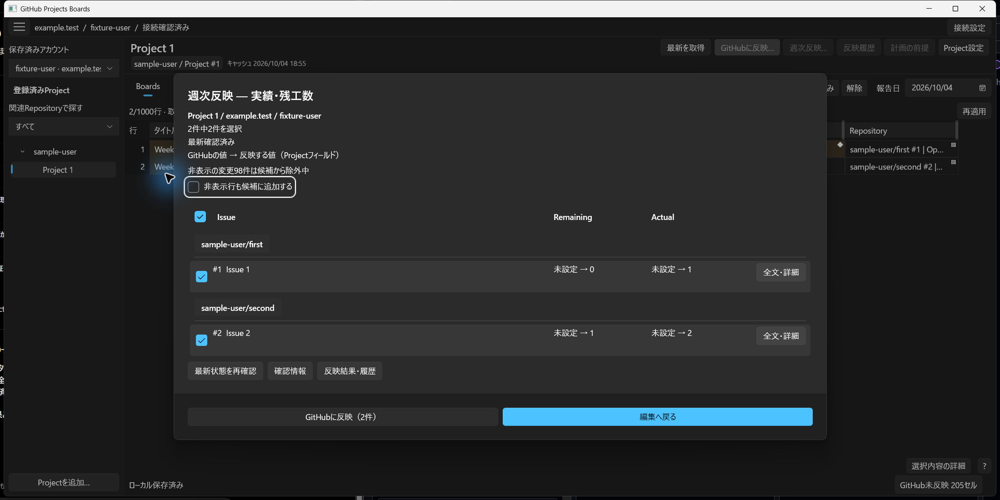

### 実績・残工数だけを反映する

1. Project上部の **週次反映…** を押します。
2. **週次反映 — 実績・残工数** で、表示中の既存行の変更済み実績・残工数が選択されていることを確認します。
3. 対象Issue、列、GitHubの値と反映する値、選択件数を確認します。不要な対象は選択を外します。
4. 最新状態の確認が終わり、問題がなければ **GitHubに反映（N件）** を押します。
5. 結果を確認し、失敗・未送信・要確認があれば **反映履歴** から対応します。

このプリセットにはタイトル、見積、日付、依存関係、新規Issue作成は含めません。日程やタイトルも反映したい場合は、通常の **GitHubに反映…** を使います。

**週次反映…** を開いた時点では送信しません。最後の **GitHubに反映（N件）** が実際の承認です。

### 非表示の行と入力途中に注意する

フィルターで隠れている行は初期対象に入りません。必要なら **非表示行も候補に追加する** にチェックし、追加された対象を自分で選びます。候補への追加だけでは選択されません。

入力途中の文字は反映対象に含みません。反映したい値がまだ入力途中の場合は **編集へ戻る** で確定し、改めて確認してください。

接続・権限・競合・最新状態の確認が必要な場合は、理由と対応先が表示されます。確認中や問題が残る間は反映できません。変更後の古い承認をそのまま使わず、現在の対象を確認します。

## Project設定とローカル作業の管理

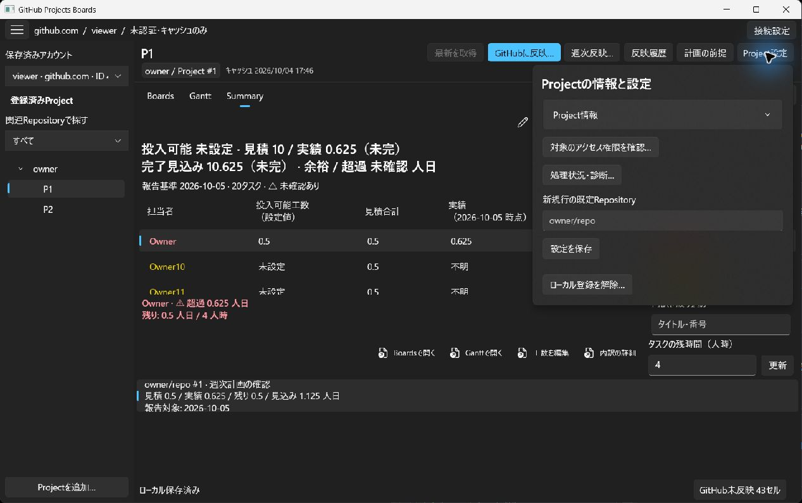

**Project設定** には、Project情報、対象のアクセス権限、処理状況・診断、新規行の既定Repository、ローカル登録の解除があります。日程計算の設定は独立した **計画の前提** を使います。

**新規行の既定Repository** は、これから作る行の初期宛先です。既存行の宛先や、Projectの取得範囲は変わりません。

**ローカル登録を解除…** はこのPCでの登録を外す操作です。GitHub ProjectやIssueを削除しません。ローカル作業が残っている場合は、保持するか破棄するかを確認してから進めます。

通常終了では、作業の保存が完了してから閉じます。次回は同じ保存済みアカウントを選んで再開できます。正確な時刻、担当者別の実績内訳、計画条件などはローカルに保持するため、GitHub上の値だけでローカル計画全体を再現できるとは限りません。

別PCへの退避・復元が必要な場合は [READMEのCheckpoint backup and isolated restore](../README.md#checkpoint-backup-and-isolated-restore) を参照してください。バックアップは同じホスト・アカウントの新しい保存先へ復元します。複数PCで同時に編集した内容の自動同期ではありません。

## 問題が起きたとき

| 状態 | 次に行うこと |
| --- | --- |
| 接続が未確認・期限切れ | **接続設定** でアカウントを確認し、再確認して元の作業へ戻ります。 |
| 権限が不明・編集できない | **最新を取得**、または **Project設定 → 対象のアクセス権限を確認…** で対象の状態を確認します。 |
| 入力を確定できない | **選択内容の詳細** または該当ダイアログで、入力途中と確定済みの値を比較して修正します。 |
| Ctrl+D・貼り付けができない | 範囲、列の種類、値、未確定入力、報告日、各行の実績担当者を確認します。エラーになった一括操作は部分的に適用されません。 |
| 日程が計算されない | Ganttの理由表示から、工数、進捗、担当者配賦、先行タスク、カレンダーの不足を確認します。 |
| 祝日の対象年が不足 | 新しい期間を含むCSVを取り込み、差分を確認して採用・保存します。 |
| 保存できない | 画面を閉じず、表示された **保存を再試行** または **ローカル保存を再試行** を使います。 |
| GitHubとの競合がある | **競合・未確認を比較** で基準・ローカル・GitHubの値を確認し、採用する値を選びます。この判断自体はGitHubへ送信しません。 |
| 取得が途中・失敗した | 完全に取得できた前回の内容と、今回の未完の取得を区別して確認します。再取得前に必要なローカル入力を残します。 |
| 反映が失敗・未送信 | **反映履歴** で対象を確認し、問題を解消してから残る変更を再確認します。 |
| 作成結果が要確認 | 同じIssueをすぐ作り直さず、履歴の **作成の不確定結果を解決** で既存Issueの確認・URL対応付けなどを行います。 |
| 詳しい理由が画面に収まらない | **状況の詳細…**、**処理状況・診断…**、対象の詳細コマンドを開きます。 |

反映中の中止は、まだ送っていない処理を止めるための操作です。既に送信した変更をGitHubから取り消すものではありません。完了・失敗・未送信・要確認を履歴で確認してください。

正常終了前の強制終了では、最後に保存できた状態までの復元になります。保存ファイルの破損や復元が必要な場合は、元のファイルを残したうえで [READMEの保存と復旧](../README.md#local-registration-storage) を参照してください。

## キーボード操作早見表

| 操作 | キー・コマンド |
| --- | --- |
| セルの編集開始 | 直接入力、F2 |
| セル確定して下へ | Enter（IME変換中は先に変換を確定） |
| セル確定して右／左へ | Tab / Shift+Tab |
| セルを選んだまま移動 | 矢印キー |
| 範囲を広げる | Shift+矢印、Shift+クリック |
| コピー／貼り付け | Ctrl+C / Ctrl+V |
| 選択した1列の先頭値を下へコピー | Ctrl+D |
| ローカル操作を取り消す | ツールバーの **元に戻す**、セル選択中のCtrl+Z |
| 入力・ドラッグの取消 | Esc（IME候補表示中は先に候補を取消） |
| 表と関連コマンドの間を移動 | F6 / Shift+F6 |

セルの端で移動しても、新しい行は自動作成されません。行を増やす場合は **新規行を追加** を使ってください。
