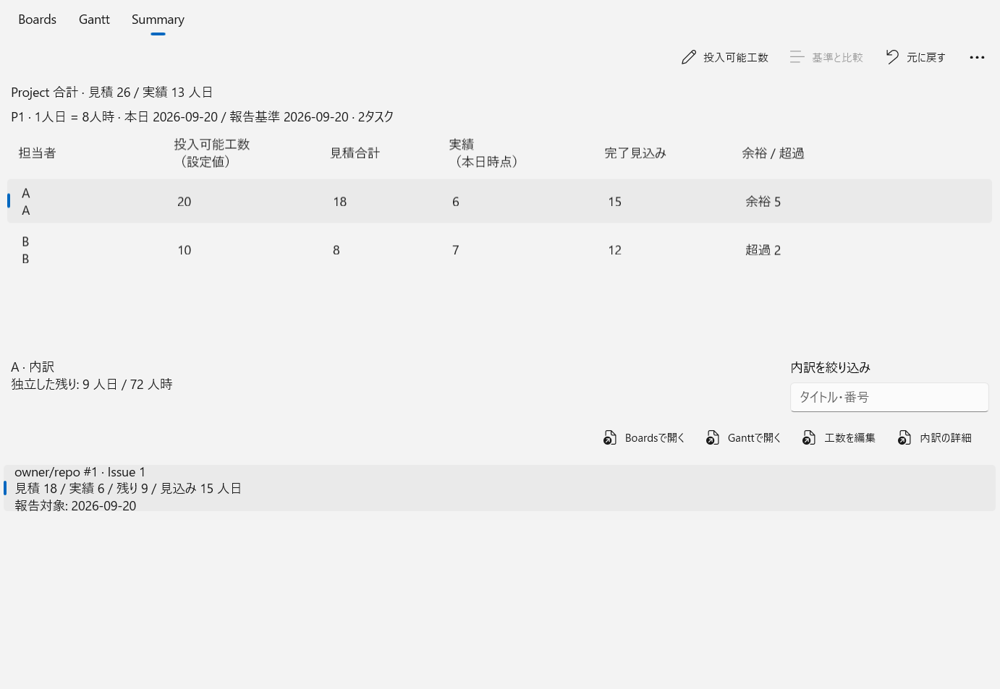
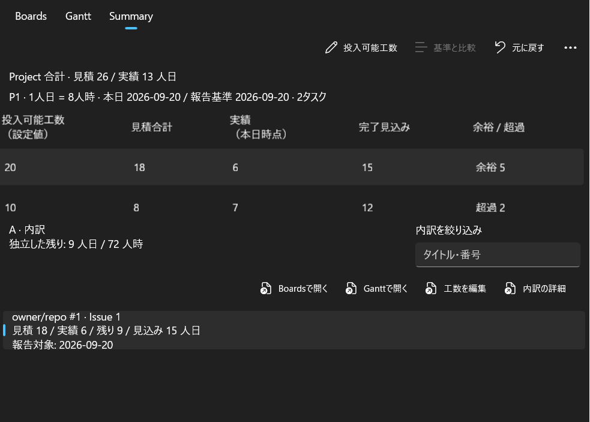

# Unit D / Issue #64 — preserved implementation checkpoint

**Incomplete and held; not ready for merge or product acceptance.** During this
run, the authoritative [roadmap](https://github.com/fukuda-yuki/gh-projects-boards/issues/1)
and [Unit D coordination update](https://github.com/fukuda-yuki/gh-projects-boards/issues/64#issuecomment-5747796216)
changed following an actual negative user evaluation of the shared input loop.
The agent read that update at approximately 14:24 JST on September 20, 2026.
Further dependent UI expansion and acceptance stopped at the running check's
safe boundary. No #61/#65 repair is folded into this branch.

The original [SUM-01–06 assignment](https://github.com/fukuda-yuki/gh-projects-boards/issues/64#issuecomment-5747636867)
still defines the feature except where the revised #61/#1 contract supersedes it.
Resume dependent UI after the corrected core loop has engineering evidence and
focused human reevaluation. This is not a wait for all of #65 or #51 to close.

## Source and foundation

Branch: `codex/issue-64-summary`. Implementation checkpoint:
`7f9818d05118dbb1c6aed0eb37b9836cc2ed6937`.
The following evidence commit changes only this directory.

The starting checkout was clean on main. A fetch and PR ancestry inspection
selected `3dcb3364d6c65f07f04b600e3b65f5ad53403557`; the final fetch returned
the same main, with no later changes to review. PR #66 is merged at
`40489a2d6eb3edfa4ed4a15775bbbbc9b9052acd`, head
`409737272ca50828143e400b15f4aa4573abe826`. PR #67 is merged at that selected
main, head `ba7294d1514b303cc91bdd6a351d12276d832019`. Both heads are ancestors
of the selected base. Each PR's two reported build checks succeeded; its
coverage-pages checks were skipped. These are inherited foundation results.

The branch was created with `git switch --no-track -c codex/issue-64-summary origin/main`.
It has no upstream at this checkpoint. Repository-local first-push settings
are `branch.autoSetupMerge=simple`, `push.default=simple`, and
`push.autoSetupRemote=true`. Publication, main integration and acceptance are
reported separately; no direct main push, merge or release occurred.

## Preserved implementation and acceptance map

The implementation uses the existing workspace, adopted plan, typed reports,
creation identity promotion, history and atomic checkpoint store. It adds no
scheduler, mutable reporting database or remote publication path. Summary
settings and protected baseline are additive metadata version 2 in checkpoint
version 10. Those version numbers are provisional until coordinated with the
reopened #61 migration; do not independently assign the same versions there.

| Group | Preserved behavior and observed checks | Open boundary |
| --- | --- | --- |
| SUM-01 | Native person table, compact Project totals, independent remaining detail, filter and contribution-to-Boards/Gantt commands. Logic establishes A=20/18/6/9→15, +5; B=10/8/7/5→12, −2 person-days. Hosted Light 1400×1000 and Dark 1000×750 table/details checks and captures executed. | Non-first-task selection into Summary is defective (review8). Unknown detail/cutoff labels also need repair. Normal/narrow human readability, full keyboard journey and larger-workload ordinary UI not accepted. |
| SUM-02 | Remaining 72→96 hours gives A forecast 120→144 while estimate144, actual48 and baseline remain. Weight edit leaves raw labor/allowance/baseline unchanged. Actual-control edit/replacement/Undo check passed against the old editor. | The old global PlanningDialog is a retained implementation route, **not the accepted future editing interaction**. Rewire to corrected #61 entry. |
| SUM-03 | Explicit zero, missing remaining, dated stale actual, future exclusion and older-cutoff inspection are covered by logic checks. Partial joint-worker reports keep the known Project subtotal incomplete. Inspection does not mutate the snapshot. | Reconcile actual-field observation/conflict presentation with the repaired input contract; do not infer fresh attestation from viewing. |
| SUM-04 | Logic checks historical workers after reassignment, independent estimate/remaining shares, unallocated balances, configured allowance-only people, canonical duplicate identity, and direct/rollup/ambiguous parent classification. | Rollup detail wrongly shows zero; conflicting duplicate values lack reconciliation. Current fallback still reads existing OwnerId semantics. Integrate revised #61 native-assignee/legacy-owner migration before finalizing assignment-sensitive behavior. |
| SUM-05 | Protected establishment, explicit replacement, operation Undo, real failed-save/retry, backup/restore, old-record migration, corrupt/future-record refusal, missing remote vs removed local scope, and normal verified creation ID promotion are exercised. Hosted pending-title three-view roundtrip and allowance retry passed. | Late first-save failure and baseline promotion collision remain review concerns. Ordinary process restart, P1/P2 UI journey and physical Summary IME cases are authored but not executed. No complete whole-app or new live-GitHub proof. |
| SUM-06 | Reused 1,000-task/20-person workload builder and isolated evaluation seed. Seed readback and launcher prepare/resume/no-overwrite checks executed. The fixture includes A/B, unknown/stale/future, reassigned/joint, parent classes, local work and baseline difference. | Summary aggregation/UI/save and visible-result timings are **not run**. No P2 pass or inherited latency repair is claimed. |

Implementation entry points: [projection](../../../src/GhProjectsBoards.Core/Projects/SummaryProjection.cs),
[protected operations](../../../src/GhProjectsBoards.Core/Projects/SummaryContract.cs),
[native view](../../../src/GhProjectsBoards.App/SummaryView.cs),
[app connection](../../../src/GhProjectsBoards.App/EditingGrid.Summary.cs),
[logic/storage cases](../../GhProjectsBoards.Tests/SummaryTests.cs),
[actual-control cases](../../GhProjectsBoards.UiIntegration.Tests/SummaryHostedTests.cs).

## Executions and limits

[validation.json](validation.json) retains separate case-level execution receipts,
binary identities, commands and failed attempts. Runs are not combined into an
all-pass total. Final logic selections are at the implementation checkpoint;
the hosted run is an earlier uncommitted source, with its exact binary hashes
and recorded source diff retained. App and hosted-test source at that run equal
the checkpoint; the final Core adds the missing-worker incompleteness fix and
moves record validation ahead of strict metadata-presence inspection. Do not
describe the older hosted execution as a rerun of the final Core binary.

| Execution | Passed / failed / skipped | Meaning |
| --- | --- | --- |
| Initial Summary Red | 0 / 1 / 0 | Observed four-value contract failure before implementation. |
| First domain selection | 11 / 0 / 0 | Earlier Summary logic/storage subset. |
| Initial broad non-live Core | 585 / 1 / 0 | The previous future-version fixture used newly adopted schema10/metadata2. It was corrected to future11/3; failure retained. |
| Selected Core before corrupt-record correction | 57 / 1 / 0 | Existing null-task corruption case exposed an unchecked JsonElement shape in the new presence check. |
| Selected Core after correction | 58 / 0 / 0 | Summary, planning contract/path and Gantt projection; real isolated store and fake external adapter where needed. |
| Final broad non-live Core | 590 / 0 / 0 | Executed at 7f9818d with deterministic Core/adapter/storage checks; no live GitHub cases selected. |
| Hosted Summary/Gantt/planning selection | 21 / 1 / 0 | Baseline replacement rejected a visual-only generation change. |
| Last hosted Summary selection | 5 / 0 / 0 | Native controls/events, pending text, table/details, allowance save failure/retry and baseline establish/edit/cancel/replace/Undo. |

The last solution build at the checkpoint succeeded with two inherited
Windows App SDK UI-host auto-initializer CS0436 warnings and zero errors.
The final broad Core case-level outcome is recorded in validation.json.
The initial normal output build failed because an already-running user's app
held Core.dll. It was left running; subsequent builds used `bin/issue64/`.
No machine setup or dependency changes were made.

Two early compilation-only attempts also failed: a shadowed baseline variable
(CS0136) and reversed RestoreBackupAsync test arguments. Both were corrected
before the reported Green executions. Their command output remains in the task
conversation; no standalone raw file was retained. They are not counted as
executed tests. A later `.slnx` command typo failed MSB1009 before the corrected
`.sln` build; its raw log is retained in the portable failure excerpt.

Environment: Windows 11 build 26200 x64; AMD Ryzen 7 9700X, 16 logical processors;
.NET SDK 10.0.401, runtime 10.0.12; Windows App SDK 1.8.260804001; Release builds.
Hosted captures use the existing desktop scaling (125% in the inspected images).
No High Contrast, alternate scaling, assistive-technology or physical scanout
acceptance was performed. The independent Oracle review status and findings are
recorded in [review.md](review.md); it returned unresolved findings, not approval.

```powershell
dotnet build GhProjectsBoards.sln -c Release -p:BaseOutputPath=bin/issue64/ -v:minimal
dotnet test tests/GhProjectsBoards.Tests/GhProjectsBoards.Tests.csproj -c Release -p:BaseOutputPath=bin/issue64/ --filter 'FullyQualifiedName~SummaryTests|FullyQualifiedName~PlanningContractTests|FullyQualifiedName~PlanningPathTests|FullyQualifiedName~GanttProjectionTests' --logger 'trx;LogFileName=checkpoint-core-02.trx' --results-directory TestResults/issue64/checkpoint-core-02
dotnet test tests/GhProjectsBoards.Tests/GhProjectsBoards.Tests.csproj -c Release -p:BaseOutputPath=bin/issue64/ --no-build --filter 'TestCategory!=LiveGitHub' --logger 'trx;LogFileName=checkpoint-full-core.trx' --results-directory TestResults/issue64/checkpoint-full-core
./scripts/Test-UiIntegration.ps1 -NoBuild -BinaryRoot "$PWD/tests/GhProjectsBoards.UiIntegration.Tests/bin/issue64/Release/net10.0-windows10.0.26100.0/win-x64" -Where 'class == GhProjectsBoards.UiIntegration.Tests.SummaryHostedTests'
```

The final broad run is justified by the shared checkpoint schema/read change;
it is not a requirement to repeat every suite while the dependent UI is held.
The hosted command documents the already executed check, not permission to
resume dependent acceptance before the revised prerequisite.

## Portable captures and local-only artifacts

These are synthetic hosted-control captures, inspected by the implementing
agent. They are not ordinary app or human acceptance. In the narrow capture,
the test intentionally scrolls the comparison table to the right; the selected
person remains in the contextual region. The duplicated short A/A and B/B
name/identity labels and the narrow table's displaced name column remain visual
review considerations, not claimed polished acceptance.




Raw artifacts are local-only under the checkout's `TestResults/issue64/` and
the `TestResults/ui-integration/run-...` locations in validation.json. This
portable directory provides sanitized receipts and real captures, not a claim
that private absolute paths are portable downloads. Captured original failures, logs,
TRX/XML, coverage attachments and synthetic checkpoint files remain unchanged.

## Isolated evaluation launcher

The launcher is preserved for review and later continuation, not a request for
the user to accept the rejected input workflow. Preparation, marker validation,
resume preparation and refusal to overwrite an existing root were observed.
Launching and completing an ordinary Summary evaluation is not run.

```powershell
./scripts/Start-SummaryCheck.ps1 -DataRoot "$PWD/TestResults/my-summary-check" -PrepareOnly -Executable "$PWD/src/GhProjectsBoards.App/bin/issue64/Release/net10.0-windows10.0.26100.0/win-x64/GhProjectsBoards.App.exe" -SeedExecutable "$PWD/tests/GhProjectsBoards.Tests/bin/issue64/Release/net10.0-windows/GhProjectsBoards.Tests.exe"
# Later, use the identical arguments plus -Resume, removing -PrepareOnly to launch.
```

The launcher changes only the new synthetic data root and the child process's
`GHPB_DATA_ROOT`. It does not connect, Apply, replace the normal data root or
change machine settings. Keep the evaluation offline. The visible seed is P1
in cached profile github.com / ID42; P2 has a separate allowance.
