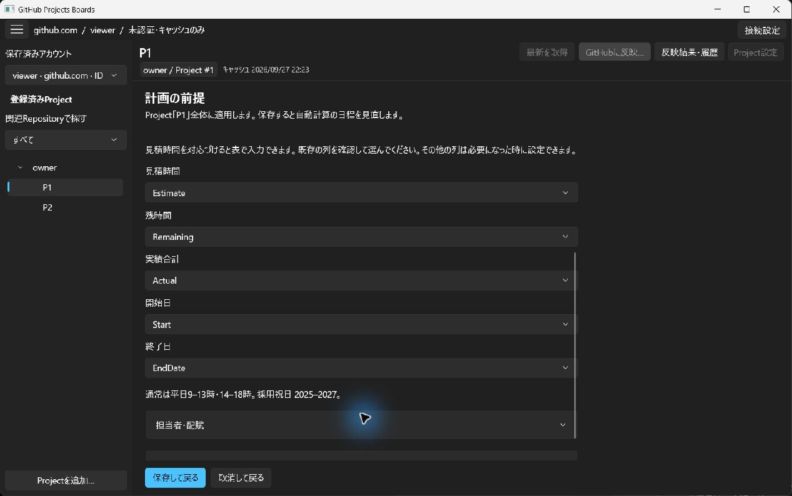
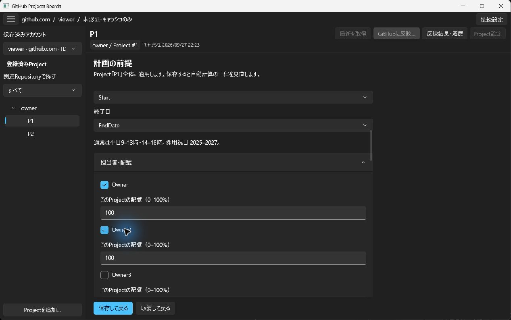
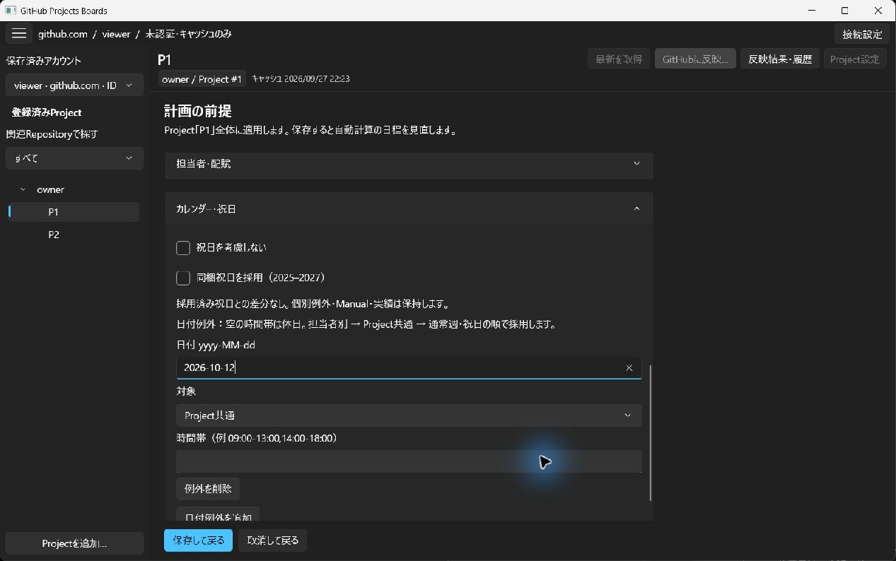
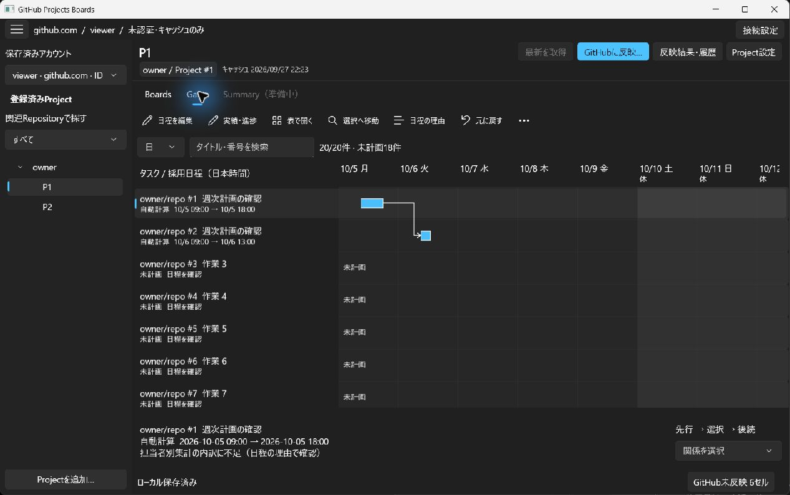
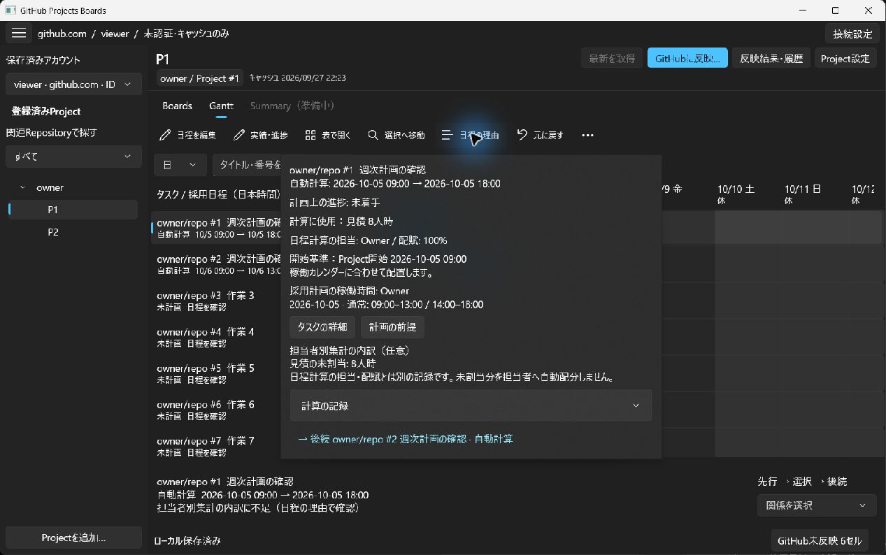
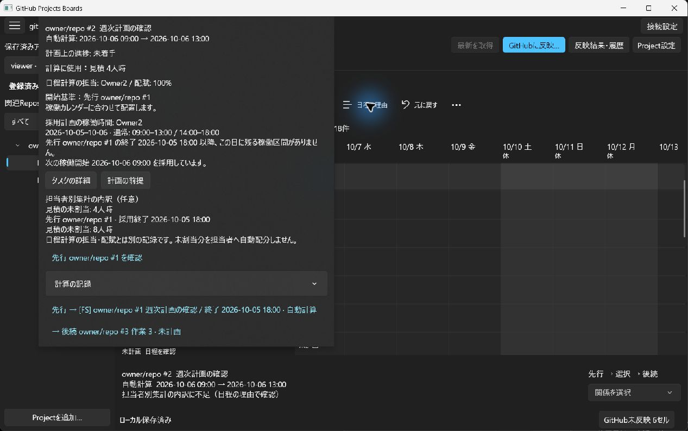
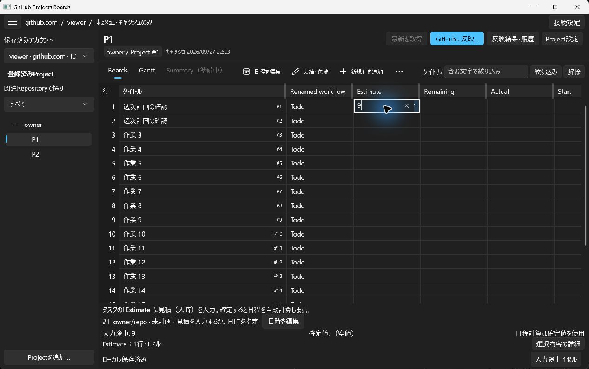
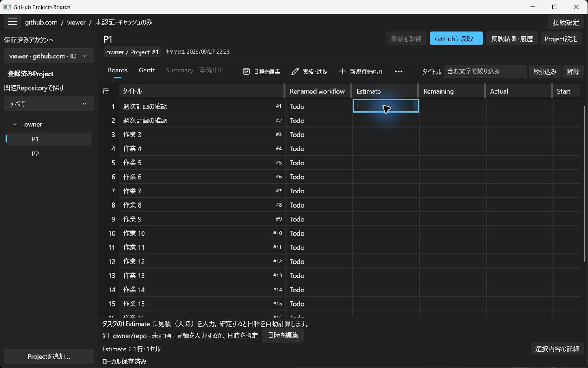
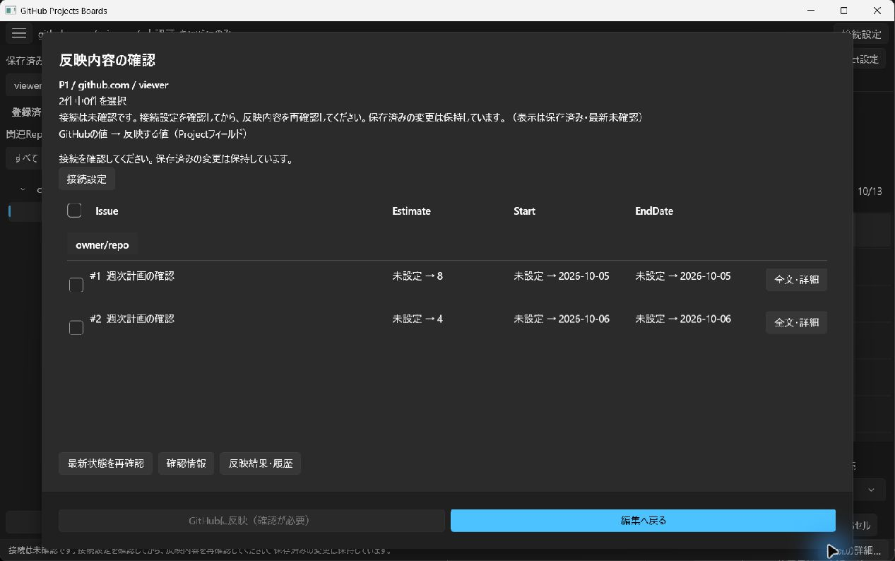
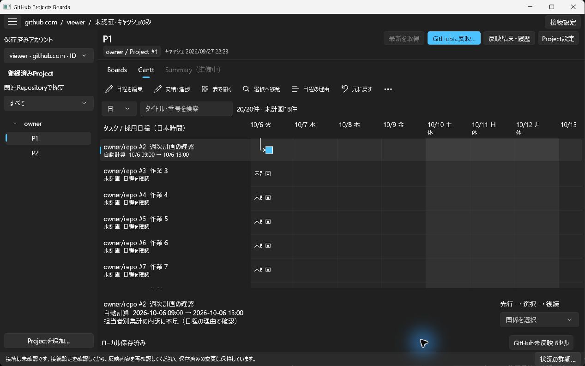

> Historical report, retained with its original candidate, failures and preparation-time status. This derivative changes relative links only; selected small attachments are copied, while other targets are explicitly local archive paths. It is not a new execution or the current task-status authority.
> Original: `tests/regression-evidence/issue73-workflows/blind-review/round7-first-q/observations/portable/continuation-evaluation.md`
> Original SHA256: `608E380632B69F4AA72ACBDAECDBC9B6FDD6FF5639CD2EFB99F2781C55F03B5D`

> Portable derivative: evaluator prose is unchanged. Only link destinations were remapped to retained originals or explicitly identified scope derivatives. Original report SHA256: `3B42FDAA30358A3C6BA9F0FEE8A1716854120FDF8676C8DB83559907251286F6`.

# GitHub Projects Boards — continuation evaluation

## Result
The two-task first schedule was completed through the visible native UI and reported locally saved. No GitHub publication was sent. The application was closed normally; refreshed native window and application inventories no longer contained the authorized target. It was not restarted. This is an agent evaluation, not human acceptance.

The original no-capture stop and its evidence remain unchanged. That stop was an infrastructure failure caused by the permitted inventory API not exposing PIDs, not a product defect. The coordinator subsequently authorized the exact previously returned app/window identity and independently associated it with PID 49208. This continuation refreshed native inventory and activated window 31129616 before its first screenshot. No OS process check or application files were read.

## Isolation and method
Before continuation application access, the evaluator disclosed that the supplied context contained no target-product history, repository-specific instructions, or earlier product findings beyond this task. Generic working preferences and computer-use guidance were present. This does not claim zero general model influence.

Only the previously permitted Computer Use skill and its required guidance/API/confirmation documents informed the mechanics. All application access used standalone node_repl and supported @oai/sky APIs. No shell interaction with the application, web research, Git, source/specification/test/cache/credential read, internal app call, custom UIA, navigation coaching, or connection/account/endpoint/CLI setting change occurred. Selecting the prepared saved account was part of the requested task. Only this evaluator supplied native input. A second agent reviewed a bounded summary of this run's observations without tools or application access.

Each input followed a screenshot-backed observation, pixel inspection, one state-derived action, and refreshed state. All captures were of the authorized target and its own transient UI. Screenshot bytes were decoded only to save the original evidence, without resizing or re-encoding. Some displayed accessibility text was shortened to avoid repeating unrelated rows; all saved raw states and public API results are complete.

## Confirmed business outcome

| Assumption | Observed result |
| --- | --- |
| Account/project | Saved viewer · github.com · ID 42; P1, owner / Project #1; unauthenticated/cache-only |
| Project start | Entered 2026-10-05 09:00 in the field explicitly labeled Japan time; saved |
| Normal capacity/calendar | Screen states weekdays 09:00–13:00 and 14:00–18:00; retained |
| October 12 holiday | Added 2026-10-12, Project-wide exception, empty working intervals; UI help says empty intervals mean a holiday. Gantt subsequently marks October 12 as rest |
| People | Enabled Owner and Owner2 with their displayed 100% project allocations; no other people enabled |
| Issue #1 | Retained Owner; Estimate 8 person-hours confirmed; not started; automatic schedule October 5, 09:00–18:00 Japan time |
| Issue #2 | Retained Owner2; Estimate 4 person-hours confirmed; not started; automatic schedule October 6, 09:00–13:00 Japan time |
| Dependency | Existing finish-to-start predecessor #1 was visible for #2 and used by calculation; retained rather than duplicated |
| Other work | 18 other issues remained unplanned; no estimates or missing planning assumptions fabricated |

Field meanings came from the planning form's labels and the table's explicit person-hour hint: Estimate → estimated hours; Remaining → remaining hours; Actual → actual-hours total; Start → start date; EndDate → finish date. All five were mapped to those existing fields. Remaining and Actual task cells stayed blank: the app explicitly calculated these not-started tasks from their estimates. No actual work or actual start/finish was entered. The replan cutoff stayed empty because its help described remaining work for in-progress/reopened tasks, whereas these tasks had not started.

## Why the dates are understandable
Issue #1's “Reason for schedule” showed not started, estimate 8 person-hours, Owner at 100%, project start October 5 at 09:00, and the normal 09:00–13:00 / 14:00–18:00 intervals. Those two four-hour intervals supply eight working hours, giving October 5 at 18:00.

Issue #2's explanation showed not started, estimate 4 person-hours, Owner2 at 100%, and predecessor #1 as its start basis. It explicitly stated that after #1 finishes October 5 at 18:00, no working interval remains that day; the next working start is October 6 at 09:00. Four hours then finish at 13:00. Both the Gantt connector and the [FS] predecessor link supported this interpretation. October 12 is visibly nonworking, but these two tasks finish beforehand, so holiday-spanning scheduling was not exercised.

## Saved, unfinished, and unpublished
The UI distinguished three states clearly during estimate entry:

- Typing a tentative 9 with an ordinary key into Issue #1's empty Estimate cell produced “unfinished input: 9,” “confirmed value: empty,” and “schedule calculation uses confirmed values,” alongside a separate locally-saved indicator.
- Escape removed the tentative 9 and restored the blank confirmed value. Entering 8 and pressing Return confirmed it; focus moved to the next row. Issue #2's 4 was likewise confirmed with Return. No unfinished task input was visible in the final state.
- The bottom status then showed locally saved and six cells not reflected on GitHub. Publication review displayed exactly two issues and three proposed fields each: #1 Estimate blank→8, Start/EndDate blank→2026-10-05; #2 Estimate blank→4, Start/EndDate blank→2026-10-06. Dates in this preview are date-only, whereas local schedule explanations include times.

The review said the connection was unverified and displayed saved, not freshly checked information. Zero of two candidates were selected and the publication action was disabled. “Return to editing” was used; no send, refresh-from-GitHub, or connection action was taken. The visible evidence supports locally saved, unpublished changes. Independent persistence verification and network auditing were not performed; the coordinator owns stored-state checks.

## Usability findings

| Finding | Evidence and business effect | Small improvement |
| --- | --- | --- |
| Scrolling can silently change a field mapping | A wheel scroll intended to move the assumptions form changed Remaining to Actual. The changed value was noticed before save and restored. An unintended mapping could be easy to miss during setup | Avoid changing a closed dropdown via wheel scrolling; let the form scroll unless the dropdown is deliberately opened |
| Useful task detail is preceded by technical content | The table's selected-cell detail starts with B/L/R values, ownership and IDs, with schedule/progress text lower down. An unfamiliar PMO must sift through diagnostic information | Put task identity, assignee, progress, dates and their reason first; move technical comparison data to a secondary disclosure |
| Optional effort breakdown looks like a planning deficiency | Gantt shows an incomplete person-level breakdown warning despite both valid schedules. The explanation clarifies that the unallocated 8/4 person-hours belong to an optional record separate from schedule capacity | Mark the optional nature in the initial notice, rather than only after opening the explanation |

Strengths: the first-plan entry point was prominent; the mapping labels and estimate hint established field meaning; cancellation clearly separated tentative from confirmed values; the two date explanations were specific enough to justify the plan; the preview made the local-to-GitHub boundary and exact outgoing fields inspectable. The other tasks remained explicitly unplanned instead of receiving invented schedules.

The generic saved-account menu, first-plan setup, and scheduling were discoverable without coaching. Two issues shared the same title, but issue numbers and repository identity allowed them to be distinguished.

## Failed routes, recovery, and tool limitations

| Observation | What happened and recovery | Classification |
| --- | --- | --- |
| Continuation initialization | The earlier runtime bindings were not retained. The initial wrapper attempt reported “fs is not defined”; its underlying failed attempt is retained in the call log. Initialized the documented package and evidence modules, then refreshed inventory before input | Infrastructure; no application mutation |
| States 15–17 | Scroll over Remaining changed it to Actual. Reopened the list and selected Remaining, visibly restoring it | Real mistaken edit, corrected before save |
| States 18–19 | Scroll just outside the form did not move it; scrolling over explanatory text inside the form did | Interaction confusion, retained |
| States 30–33 | Indexed click on the expanded allocation section did not collapse it. Refreshed, then clicked the visible header chevron, which collapsed it | Supported-tool targeting behavior; not proven to be a human click defect |
| States 37–39 | Accessibility reported the old project-start focus after clicking the holiday input, even after refresh. Pixels showed the caret and blue underline in the empty holiday-date input; literal text appeared in the correct holiday field | Accessibility/tool discrepancy; pixels and resulting text used to verify |
| States 43–44 | Tentative estimate 9 was intentionally entered with an ordinary single-character key and canceled with Escape; blank confirmed value restored | Requested mistaken-edit exploration, successful cancellation |
| Early transitions | Some immediate tree and screenshot states differed during navigation/animation; extra observations were retained where needed | Capture timing limitation; no hidden reset |

The two type_text calls were literal/bulk entries, not simulated single-character typing: 2026-10-05 09:00 into the empty direct project-start field, and 2026-10-12 into the visibly focused empty holiday-date field. The event log records the returned focus/selection metadata and the holiday focus discrepancy. Numeric tentative/task edits used ordinary press_key calls.

No invalid-input validation error was encountered. Missing initial project start/mappings/capacity and task estimates were supplied through the visible controls. No attempt was made to invent values merely to remove warnings. The optional unallocated-effort warnings remained, as did the 18 unplanned tasks.

## Completion and limits
Completed through UI: selecting the prepared project, setting project/calendar/capacity assumptions, confirming the two estimates, retaining assignees and their existing dependency, obtaining and explaining the first schedule, comparing the table and Gantt, canceling a mistaken edit, inspecting publication changes and returning without sending, and closing normally.

Unverified or outside this local evaluation: on-disk persistence after exit, remote GitHub state, connection behavior, publication execution, holiday-spanning scheduling, and planning the remaining tasks. These are not reported as successful. The original independently recover-PID requirement was unmet in the preserved infrastructure run and explicitly revised by the coordinator before this continuation.

Normal close: clicked the target's title-bar X. The first immediate list_windows result still included it; a subsequent refreshed list_windows omitted it. Final list_apps also contained no matching target application. No confirmation dialog was observed, no force-close was used, no unrelated app screenshot was taken afterward, and the target was not restarted. See [close verification](../assets/139BE4622577-continuation-close-verification.json).

## Evidence

- Ordered public API calls, arguments, timestamps and complete results (local archive: `tests/regression-evidence/issue73-workflows/blind-review/round7-first-q/observations/derived/continuation-public-api-calls.json`)
- [All observations and original screenshot filenames](../assets/ADEE020619EE-continuation-state-index.json)
- [Events and literal text-entry focus records](../assets/D71D4825C25A-continuation-events.json)
- [Normal-close verification](../assets/139BE4622577-continuation-close-verification.json)
- [Evidence link and image metadata verification](../assets/8761E450EECE-continuation-evidence-verification.json)

Each continuation-state-NNN.json contains the complete raw returned state, including original screenshot data URLs. Its corresponding image files preserve those exact decoded bytes with MIME-matching extensions. An initial report-link check caught incorrectly assumed PNG extensions; the links were corrected to the original JPEG filenames before delivery. All report links and all indexed raw/image files were checked within the temporary workspace. Original evidence was not overwritten or read back. Findings above derive from this continuation's visible UI only.
